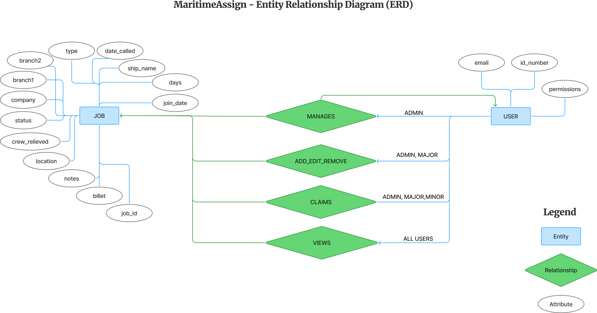
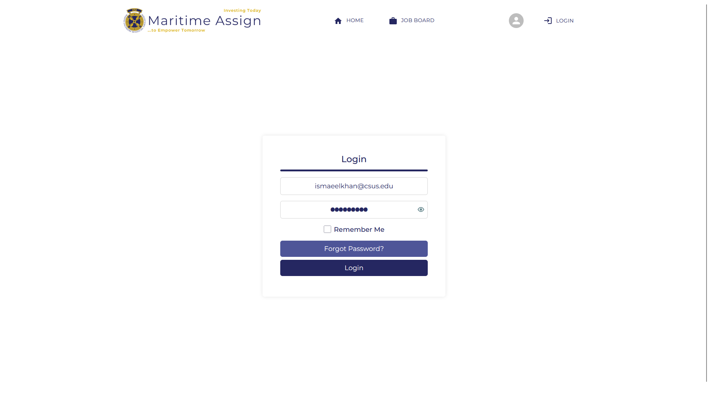
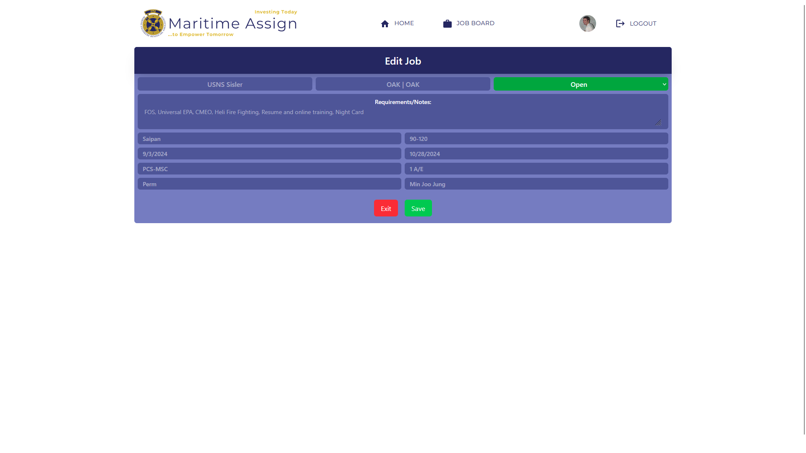
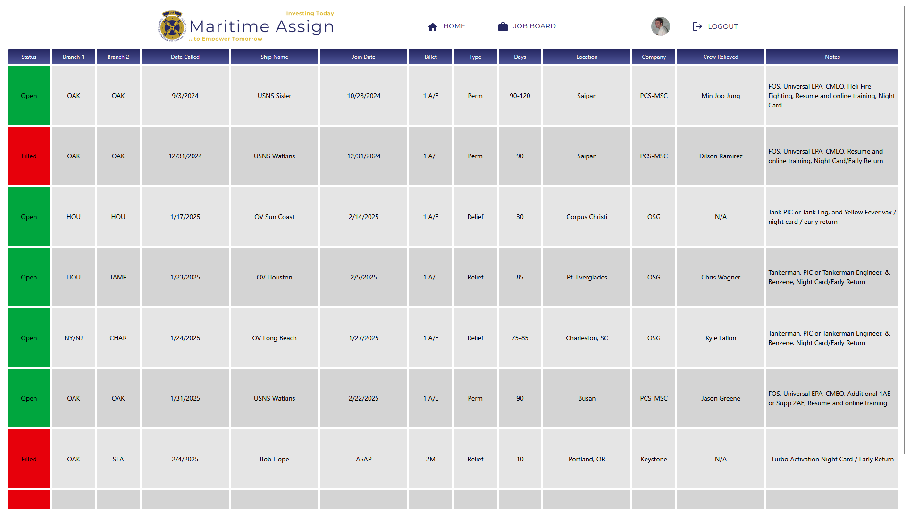

# MaritimeAssign - React

    

### About the Project

This React project serves as the front end for the Marine Engineers' Beneficial Association (MEBA) Union joboard. It allows MEBA union employees to:

- Log in and view current job listings (both available and claimed).
- Edit specific columns or entire rows of data, provided they have the necessary privileges granted by an admin.
- Access a display-only page for viewing data in a union hall setting.

### ERD

    

### Running the Project for Testing and Development

You can build the project using one of the following methods:

### Project Screenshots

Here are some screenshots of the project in action:

#### Login Page

#### Data Editing

#### Union Hall Display

#### Option 1: Build with command line

1. Install Node.js (Version 22 or any even-numbered version).
2. Run `npm install -g npm@11.2.0` to update npm.
3. Install Vite globally: `npm install -g vite`.
4. Install Supabase.js globally: `npm install -g supabase-js`.
5. Install project dependencies: `npm install`.
6. Start the development server: `npm run dev`.
7. The project will be available at `http://localhost:5173`.

#### Option 2: Build with Docker

Refer to the [Docker Instructions](https://github.com/Maritime-Assign/ReactProject/blob/main/README.Docker.md) for detailed steps.
