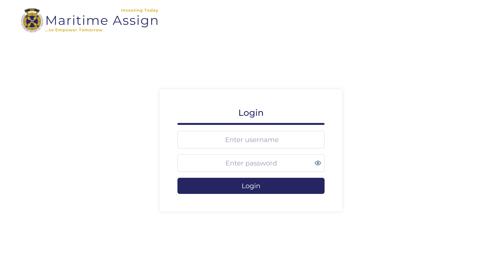
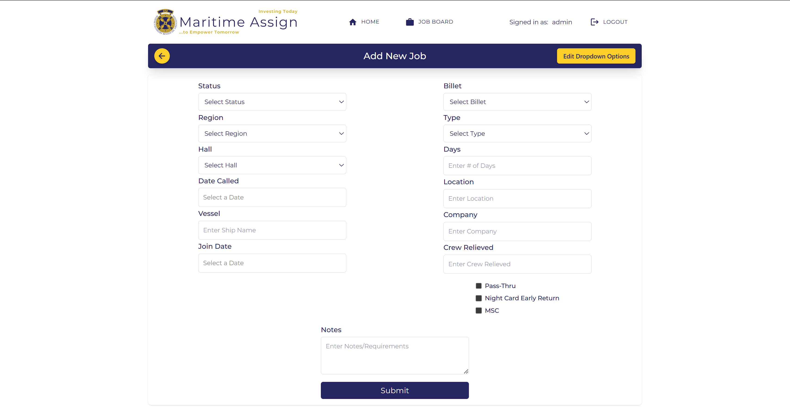
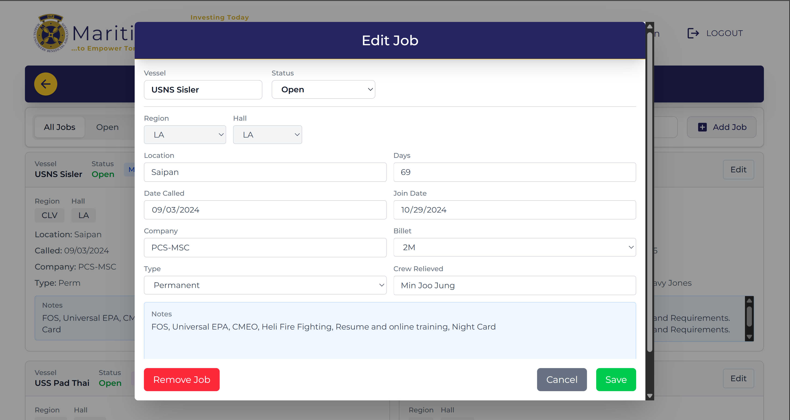
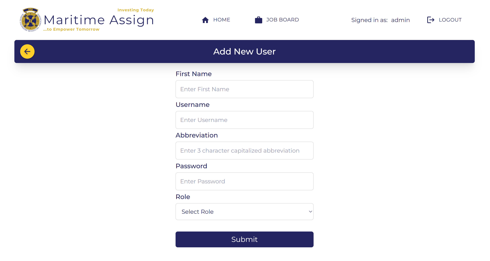
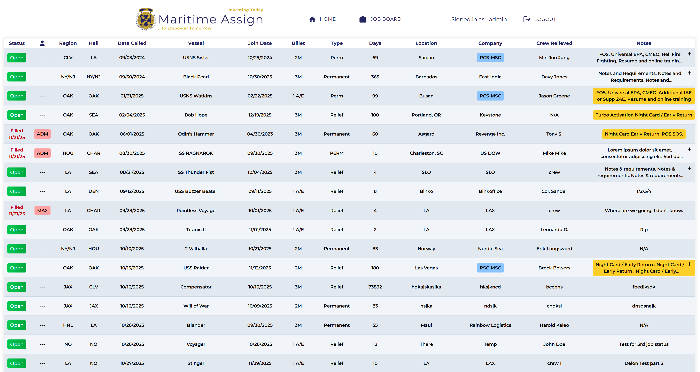
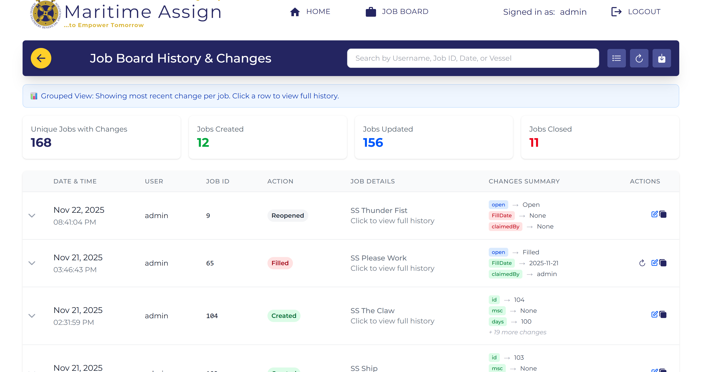
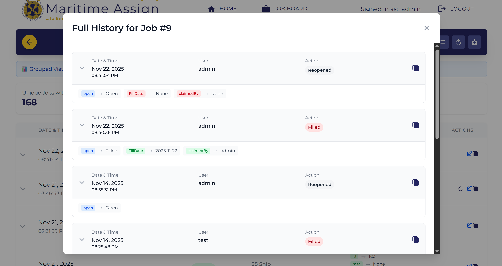

# Maritime Assign 

  

# Project Overview and Purpose

MaritimeAssign is a web-based job management platform built for the Marine Engineers’ Beneficial Association (MEBA) to replace their outdated Google Sheets-based job board. The application centralizes job listings, streamlines dispatch workflows, and provides secure role-based access for union members, dispatchers, and administrators.
It was created to improve reliability, security, efficiency, and real-time visibility for a nationwide maritime job distribution system.

### What it does:
- Provides a real-time job board with filtering, editing, and claiming capabilities
- Secures access using Supabase authentication and role-based permissions
- Logs all changes through a searchable, filterable job history system
- Offers a display-only union hall mode for public viewing
- Allows admins to manage users, roles, and job dropdown configurations

### Why it was created:
- To replace MEBA’s error-prone, manual Google Sheets workflow
- To reduce data-entry mistakes and prevent unauthorized edits
- To provide a scalable, secure, cloud-hosted solution for MEBA’s operational needs

### Live Deployment
The MaritimeAssign application is deployed and accessible at: https://meba.pages.dev/

### DB Schema

  

### Project Screenshots

Here are some screenshots of the project in action:

#### Login Page

  

#### Data Editing

  

  

  

  

#### Union Hall Display

  

#### Viewing Job History

  

  

### Team / Contributors
| Name              | Contact                                                   |
| ----------------- | --------------------------------------------------------- |
| Byron Saylor      | [byrontsaylor@gmail.com](mailto:byrontsaylor@gmail.com)   |
| Kevin Jackson     | [kevinjackson@csus.edu](mailto:kevinjackson@csus.edu)     |
| Delon Chisolm     | [delonschisolm@gmail.com](mailto:delonschisolm@gmail.com) |
| Nick Janota       | [jnjanota@gmail.com](mailto:jnjanota@gmail.com)           |
| William Scott     | [wscott@csus.edu](mailto:wscott@csus.edu)                 |
| Phong Ho          | [lyhongyen1979@gmail.com](mailto:lyhongyen1979@gmail.com) |
| Alexandra Allwein | [aallwein@csus.edu](mailto:aallwein@csus.edu)         |
| Ismaeel Khan      | [IsmaeelNKhan@gmail.com](mailto:IsmaeelNKhan@gmail.com)   |
| Derek Tran        | [derektran@csus.edu](mailto:derektran@csus.edu)           |

### Testing and Development

This project uses Vitest + React Testing Library.

You can build the project using one of the following methods:

1. Run all tests: `npm run test`
2. Watch mode: `npm run test:watch`
3. Coverage report: `npm run coverage`

### Setup Instructions (Local Development)

1. Clone the repository
- `git clone https://github.com/Maritime-Assign/ReactProject.git`
- `cd ReactProject`
2. Install dependencies: `npm install`
3. Create environment variables
- `VITE_SUPABASE_URL=your_supabase_project_url
VITE_SUPABASE_ANON_KEY=your_supabase_anon_key`

4. Start the development server: `npm run dev`
5. Build the project: `npm run build`
6. Preview the production build locally: `npm run preview`

### Build with Docker

Refer to the [Docker Instructions](https://github.com/Maritime-Assign/ReactProject/blob/main/README.Docker.md) for detailed steps.
